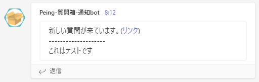

# Peing-Notifier
Peing-質問箱-に来た新規の質問をTeamsとDiscordないしはその片方へ通知する。

## 仕様
- Peing-質問箱-にログインし、未回答の質問を取得。
- 質問IDから通知済みかを判定して、未通知ならTeamsとDiscordに通知を行う。
- 回答した質問IDを"questions.csv"に保持する。

## 運用について
MacOSやLinux上ならcronを、Windows上ならタイムスケジューラーなどを利用して定期的にコードを実行すればいいと思います。
過去の質問をIDで保持する仕様なので一度通知した質問は通知されず、新規の質問のみ通知されるようになっています。

## ファイルについて
- main.py ...未回答の質問について、TeamsとDiscordに通知を行う。
- main_teams.py ...Teamsだけに通知を行う。
- main_discord.py ...Discordだけに通知を行う。
- settings.toml ...TeamsとDiscordのWebhook、PeingのID情報が記述されたファイル。(リポジトリ上では"settings_sample.toml")
  - TeamsのWebhook：[こちら](https://learn.microsoft.com/ja-jp/microsoftteams/platform/webhooks-and-connectors/how-to/add-incoming-webhook?tabs=dotnet)を参照して取得。
  - DiscordのWebhook：[こちら](https://support.discord.com/hc/en-us/articles/228383668-Intro-to-Webhooks)を参照して取得。
- questions.csv ...通知済みの質問IDを保持。初期状態だと空のファイル。（リポジトリ上では"questions_sample.csv"）

## 通知イメージ
Teams

Discord

